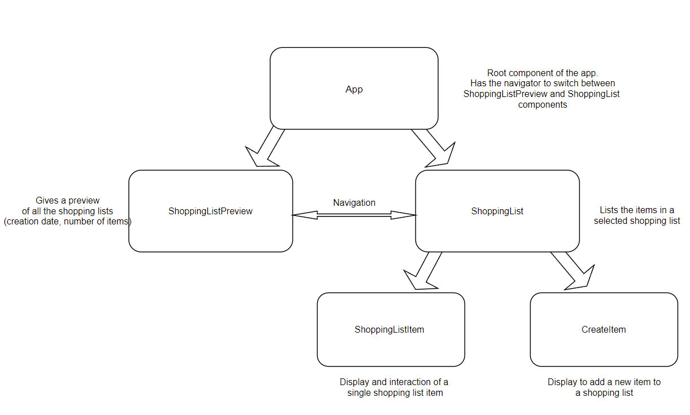

# Shopping List Application - test assignment for MobiLab

## Overview
This application was developed as a test assignment for the position of software engineer at MobiLAB. It is an application for creating and manipulating shopping lists. The user is able to create and delete shopping lists, add and remove items from them, and mark items as checked. 

It is developeved on the React-Native platform, using React-Native CLI. It was developed for (tested on) Android phones, as the author did not have access to Apple devices (you would need a macbook for iOS development?)

## Running the project

### Using the pre-built .apk file

A pre-build .apk file exists for the application, which can be found here: https://drive.google.com/file/d/1ySM4iCfAUmsPcNpibtDy77oxvZjYKQQU/view?usp=sharing 

This will probably be the easiest way to test out the application. You will need to navigate to link on your android phone, download the .apk (and if not already done, allow installation of .apk files from other sources), install it and start it from your phone.

### Running it in a development environment

Running React-Native applications in a development environment requires quite a bit of setup. I will refer you to the guide I followed: https://reactnative.dev/docs/environment-setup 

The application can be run on either phone emulators or physical devices. The above mentioned link contains information on how to achieve that as well. But in short, if you have the environment set up, and a successfully running emulator or a connected physical device, to run the application you would need to do the following steps:

* clone the repository
* navigate to the root folder and run ```npm install``` to install dependencies
* with a terminal open in the root folder, run ```npx react-native start``` to start the metro service; leave it running in the terminal
* with the terminal open in the root folder, run ```npx react-native run-android``` to build the app on the test device and run it

To run the tests, in the root folder run ```npm run test```, which runs tests using jist.

## Architecture overview

It is an anroid application developed with React-Native framework. It is mostly a monolithic application, requiring no external services, except cloud storage. 
The cloud storage solution used for this was https://jsonbin.io/ . It enables the app to easily store and retrieve json data in the cloud (with the free account having some limitaions). Communication with the service is handled by just two types of requests. GET to the url, to retrieve the entire json object (a list of shopping lists) and PUT to store the object modified in the application. 

As for the inner workings of the app, I will just add an image of the component tree:



## Other notes

Some shortcomings:

* The type of cloud service, and how it is used, made it easier to develop the application, but the implementation has pretty poor persistence and it is pretty easy to cause concurrency propblems (especially when the application is used from multiple devices at once)
* The test suite has only a few unit tests. It should require alot more, such as UI tests, integration tests, end-to-end tests, etc.
 


